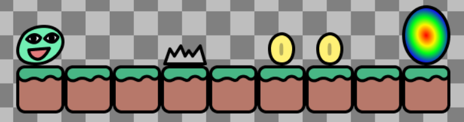
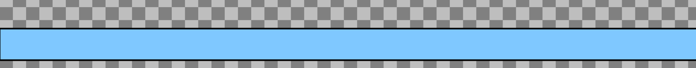

# Entry 2: Changing and tinkering new tool
##### 12/12/2022

### Content
The tool I chose initially is [ThreeJS](https://threejs.org/) but after tinkering with it, I figured that it wasn’t the right tool for my freedom project. So I went back to the [doc](https://docs.google.com/document/d/1oJFrErlAZvB-0V923QGOm4X3CwiceJsKot2R6Jz8Mdc/preview) with all the different lists of tools to choose from and chose [Kaboom](https://kaboomjs.com/). Kaboom would be a better choice because it is more efficient in helping make games, which is what I want. While ThreeJS, mainly focuses on 3d models and 3d scenes. I saw that for Kaboom, I can make the characters/objects move around by clicking on the screen or using the keyboards.

### From Kaboom Website
When looking through the different examples inside the kaboom playground, what surprised me the most is that you can replace a sprite with a symbol so that you don’t have to continue typing the sprite ( which is more convenient).
EX: From [scenes](https://kaboomjs.com/play?demo=scenes) (included inside the playground)
```java
const LEVELS = [
	[
		"@  ^ $$ >",
		"=========",
	],
]
```
This shows:

 

* (@) means bean
* (=) means grass
* ($) means coin
* (^) means the gray spikes
* (>) means the portal

### Setup
After I looked at the different examples inside the playground, I went to code.js to set up my code and tinker there. I set up my code by using the CDN. I copied and pasted this code into the JS section of the HTML.
```java
<script type="module">
// import kaboom lib
import kaboom from "https://unpkg.com/kaboom/dist/kaboom.mjs";
// initialize kaboom context
kaboom();
// add a piece of text at position (120, 80)
add([
    text("hello"),
    pos(120, 80),
]);
</script>
```
Code result:
 

 ### Challenge One (making "hello" move)
 From what I saw from [“movement”](https://kaboomjs.com/play?demo=movement) inside the kaboom playground, I also want to make it happen in my own code that the characters move around, so I copied the code from the website into my own code :
```java
onKeyDown("right", () => {
	player.move(SPEED, 50)
})
```
→ I saw that for`player.move(SPEED,0)`, as the number gets bigger, the character moves slanted down towards the right. BUT if the number gets smaller, the character will move slanted upwards towards the right.


### Challenge Two (add platform)
From looking at the Kaboom website, I learned to add a platform to the game:
```java
// add platform
add([
    rect(width(), 48), //renders a rectangle
    pos(0, height() - 48), // position
    outline(4),  // thickness of the border around the platform
    area(), // adds a collider to it
    solid(), // makes other objects impossible to pass through
    color(127, 200, 255), // // color of the platform
])
```
 
 → the blue on the bottom (platform)

The height of the platform can be made bigger by changing the number of the width larger. If the height is bigger than the width, then the platform will shift upwards and will not start at the bottom of the page.
EX:
```java
    rect(width(), 78),
    pos(0, height() - 100),
```


### Challenge Three
I wanted to add more than one character to the website. I used this [page](https://kaboomjs.com/play?demo=add) as a reference.

← I did get the image on the page but it is too large.

I used `scale()` to make the image smaller so that it is an appropriate size.
```java
        loadSprite("cookie" , "/img/cookie.png" )
        add([
            sprite("cookie"),
            pos(120,80),
            rotate(0),
            origin("center"),
            scale(0.2) // make the size of the image smaller
        ])
```
Result of code:


### Important functions/ components I learned that are useful
* add() : assemble all the components into a game object in kaboom (both text and sprites)
* sprite() : renders images ( Include inside add())
* text() : renders text (Includ inside add())
* loadSprite() ：
	* Helps load the sprite
	* The format to load the sprite is: `loadsprite(“name-of-sprite”, “/folder-for-the-sprites/sprite-link(.jpg/.png”)`
* onKeyDown() : runs when the arrow key is pressed (left, up, right, down)
* rect(x,y) : Render as a rectangle (x is width, y is height)
* circlex() : render as circle (x is radius of the circle)


### EDP
The engineering design process I am at right now is to plan the most promising solution and test and evaluate the prototype because I am choosing and securing the most suitable tool to help build my freedom project and tinkering with that tool by making mini challenges myself.

### Skills
The skills I learned while learning my tool are collaboration and communication because, for this freedom project, I am working with a partner. Me and my partner learned to rely on each other for help and ask peers when we are stuck.


[Previous](entry01.md) | [Next](entry03.md)

[Home](../README.md)