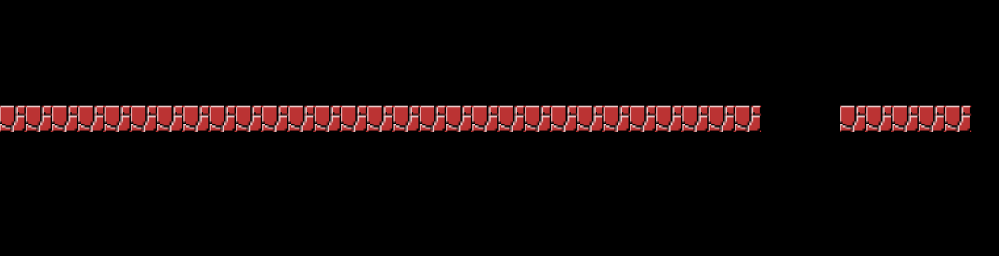
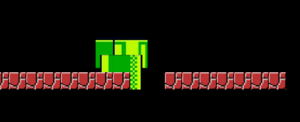
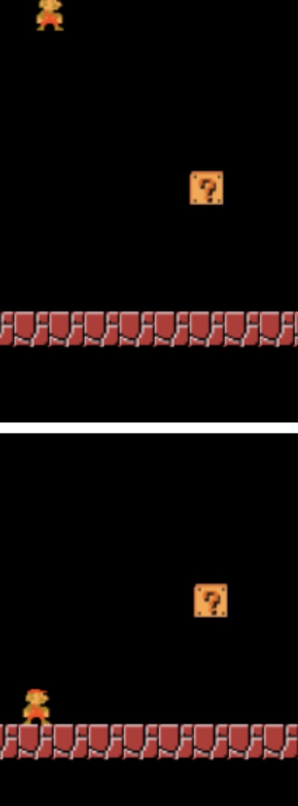

# Entry 3
##### 2/13/2023

### Context
After a few weeks of tinkering with kaboom, I have learned more information about how I can build my game. In my last blog, I wrote about how I went through the website and learned from examples shown in the Kaboom website. A goal that I talked about was exploring/learning more about the “scenes”.

### EDP
I found this [video](https://www.youtube.com/watch?v=2nucjefSr6I) that teaches you how to create a game with Kaboom. This caught my eye because I am hoping that I will be able to learn more about scenes from this video.

### EDP + Skills
The engineering design process I am at right now is “research the problem” because I am looking at tutorials and videos to help me better learn the tool. The skills I learned while learning my tool are “how to learn” and “attention to detail” because in order to learn more about scenes and how to apply it to my project, I would need to know what components are being applied to make the scene work. During the times where I am tinkering on Kaboom, I also encountered problems that made my code not function properly. The problems I made were minor such as confusing “{“ with “(“ or spelling errors. This results in me paying more attention to my code so I make the same mistakes twice and avoid code results not displaying.

[Previous](entry02.md) | [Next](entry04.md)

[Home](../README.md)
