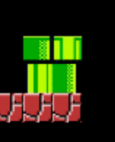

# Entry 3
##### 2/13/2023

### Context
After a few weeks of tinkering with kaboom, I have learned more information about how I can build my game. In my last blog, I wrote about how I went through the website and learned from examples shown in the Kaboom website. A goal that I talked about was exploring/learning more about the “scenes”.

I found this [video](https://www.youtube.com/watch?v=2nucjefSr6I) that teaches you how to create a game with Kaboom. This caught my eye because I am hoping that I will be able to learn more about scenes from this video.

Below I have separated what I learned in different parts of the video:

------------------

### Layers and sprites
For this part of the video, I learned how to make the floor of the game by using symbols.
First I will have to load in sprites.
 If I want to load in sprites from an website, I would need to use `loadRoot()` (__) = The website that stores all the sprites needed

→    `loadRoot ('https://i.imgur.com/') // the pathway to access all the images needed for the sprite`

→   ` loadSprite('coin', 'wbKxhcd.png') // the name you give the sprite, link to the sprite`

After that, I constructed a map of the game using symbols:
```java
 const map = [
                '                                       ',
                '                                       ',
                '                                       ',
                '                                       ',
                '                                       ',
                '                                       ',
                '                                       ',
                '                                       ',
                '                                       ',
                '==============================  =======', // the floor of the game
            ]
```


I assign the sprite to a symbol:
```java
const levelCfg = {
                width: 20,
                height: 20,
                '=': [sprite('block'),solid()]
            }
```
→ the width and the height sets the size of the sprites

→  the structure to assign the sprite to a symbol: `[sprite(‘_sprite name__’),solid()]`

Then I would have
`const gameLevel = addLevel(map,levelCfg)`
→ this would mean passing through the first level (which is the variable map that consists of the map) and the variable levelCfg which consists of the process of assigning the sprite to the symbol.

`addLevel` means construct the level based on the symbols

→ the result


### Placing sprites on the first level
`'(': [sprite('pipe-bottom-left'), solid(),scale(0.5)],`
→ scale() is being used when the sprites are overlapping each other
 This


To this:


### Adding Mario
```java
const player = add([
                sprite('mario'),solid(),
                pos(50,160),
                body(),
                origin('bot') // p.s origin is included when use body()
            ])
```
→ Using `add()` to add the sprite into the  game

→ Using `body()` makes the sprite move / give gravity to the sprite


→ The first image does not use `body()` therefore it stays still in one position but the second image uses `body()` therefore the sprite jumps from its original position

### Keyboard events
* Learned how to move the sprite in the direction that you want by pressing the keys on the keyboard.
* `keyDown()` runs every frame when a key is held down.
* `keyPress()` runs when the user presses a certain key.

Example:
```java
keyDown('left', () => {
                player.move(-120, 0)
            })
```

→when the left arrow is pressed, the user moves left. (However the sprite will move in the right direction when the x value is positive

### Coin and mushroom
When the sprite touches that object then that object gets destroyed. In this scenario when the head of the mario touches the surprise box, then the coin will appear ($ = coin)
```java
player.on("headbump", (obj) => {
                if (obj.is('coin-surprise')){
                    gameLevel.spawn('$', obj.gridPos.sub(0,1))
                    destroy(obj)
                }
            })
```

→ Spawn means the object appearing at a certain point in the game

* collision:

```java
player.collides('coin', (c) => {
    destroy(c)
    scoreLabel.value++
    scoreLabel.text = scoreLabel.value
  })
```
→ This code above is saying that when the sprite collides with the coin, then the coin will disappear (coin is being collected by the sprite)

→ `scoreLabel.value++` means that when sprite collects a coin, a point will increase
### EDP + Skills
The engineering design process I am at right now is “research the problem” because I am looking at tutorials and videos to help me better learn the tool. The skills I learned while learning my tool are “how to learn” and “attention to detail” because in order to learn more about scenes and how to apply it to my project, I would need to know what components are being applied to make the scene work. During the times where I am tinkering on Kaboom, I also encountered problems that made my code not function properly. The problems I made were minor such as confusing “{“ with “(“ or spelling errors. This results in me paying more attention to my code so I make the same mistakes twice and avoid code results not displaying.

[Previous](entry02.md) | [Next](entry04.md)

[Home](../README.md)
